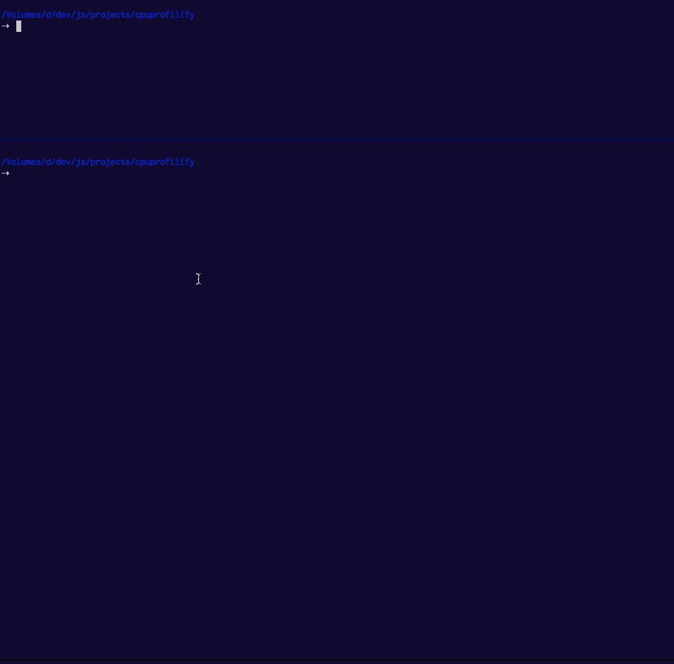

# cpuprofilify [](http://travis-ci.org/thlorenz/cpuprofilify)

[](https://ci.testling.com/thlorenz/cpuprofilify)

Converts output of various profiling/sampling tools to the .cpuprofile format so it can be loaded into Chrome DevTools.



<!-- START doctoc generated TOC please keep comment here to allow auto update -->
<!-- DON'T EDIT THIS SECTION, INSTEAD RE-RUN doctoc TO UPDATE -->
**Table of Contents**  *generated with [DocToc](https://github.com/thlorenz/doctoc)*

- [Installation](#installation)
- [Instructions](#instructions)
- [Example](#example)
- [Usage](#usage)
- [cpuprofilify and `perf`](#cpuprofilify-and-perf)
- [API](#api)
    - [CpuProfilifier()](#cpuprofilifier)
    - [CpuProfilifier::convert(trace, opts) → {Object}](#cpuprofilifierconverttrace-opts-→-object)
- [License](#license)

<!-- END doctoc generated TOC please keep comment here to allow auto update -->

## Installation

    npm install -g cpuprofilify

## Instructions

cpuprofilify installs two binary scripts:

- **`profile_1ms.d`**: DTrace script that samples your process, use either of the following to generate a trace
  - `sudo profile_1ms.d -c <command> | cpuprofilify > out.cpuprofile`
  - `sudo profile_1ms.d -p <process id> | cpuprofilify > out.cpuprofile`
- **`cpuprofilify`**: which will convert a *perf* or *DTrace* trace into a `.cpuprofile` importable into Chrome DevTools

## Example

*using DTrace script*

```sh
# In Terminal A

➝  sudo profile_1ms.d -c 'node --perf-basic-prof example/fibonacci' | cpuprofilify > /tmp/example.cpuprofile
pid <process-pid>
HTTP server listening on port 8000

# In Terminal B
➝  ab -n 6 -c 2 http://:::8000/1000/
This is ApacheBench, Version 2.3 <$Revision: 1554214 $>
Copyright 1996 Adam Twiss, Zeus Technology Ltd, http://www.zeustech.net/
Licensed to The Apache Software Foundation, http://www.apache.org/

Benchmarking :: (be patient).....done
[ .. ]

➝  sudo kill <process-pid>
```

Now open `/tmp/example.cpuprofile` in Chrome DevTools *Profiles - Load*

**NOTE:** in order to try the above example please clone this repository.

## Usage

```
cat trace.txt | cpuprofilify <options> > my.cpuprofile 

  Converts the given trace taking according to the given opttions


OPTIONS:

--shortStack   , --noshortStack     stacks that have only one line are ignored unless this flag is set (default: false)
--unresolveds  , --nounresolveds    unresolved addresses like `0x1a23c` are filtered from the trace unless this flag is set (default: false)
--sysinternals , --nosysinternals   sysinternals like `__lib_c_start...` are filtered from the trace unless this flag is set (default: false)
--v8internals  , --nov8internals    v8internals like `v8::internal::...` are filtered from the trace unless this flag is set (default: false)
--v8gc         , --nov8gc           when v8internals are filtered, garbage collection info is as well unless this flag set  (default: true)

--type                              type of input `perf|dtrace`. If not supplied it will be detected. 
--help                              print this help

EXAMPLE:

  Generate cpuprofile from DTrace data with default options

    sudo profile_1ms.d -c <command> | cpuprofilify > out.cpuprofile

  Generate cpuprofile from DTrace data with default options keeping v8 internals

    sudo profile_1ms.d -c <command> | cpuprofilify --v8internals > out.cpuprofile

  Generate cpuprofile from DTrace data with default options filtering v8 gc events
    
    sudo profile_1ms.d -c <command> | cpuprofilify --nov8gc > out.cpuprofile
```

## cpuprofilify and `perf`

*use this on any system that doesn't have DTrace, but perf instead like Linux*

```sh
perf record -e cycles:u -g -- node --perf-basic-prof myapp.js
perf script | cpuprofilify > out.cpuprofile
```

## API

<!-- START docme generated API please keep comment here to allow auto update -->
<!-- DON'T EDIT THIS SECTION, INSTEAD RE-RUN docme TO UPDATE -->

<div>
<div class="jsdoc-githubify">
<section>
<article>
<div class="container-overview">
<dl class="details">
</dl>
</div>
<dl>
<dt>
<h4 class="name" id="CpuProfilifier"><span class="type-signature"></span>CpuProfilifier<span class="signature">()</span><span class="type-signature"></span></h4>
</dt>
<dd>
<div class="description">
<p>Creates new CpuProfilifier</p>
</div>
<dl class="details">
<dt class="tag-source">Source:</dt>
<dd class="tag-source"><ul class="dummy">
<li>
<a href="https://github.com/thlorenz/cpuprofilify/blob/master/index.js">index.js</a>
<span>, </span>
<a href="https://github.com/thlorenz/cpuprofilify/blob/master/index.js#L11">lineno 11</a>
</li>
</ul></dd>
</dl>
</dd>
<dt>
<h4 class="name" id="CpuProfilifier::convert"><span class="type-signature"></span>CpuProfilifier::convert<span class="signature">(trace, <span class="optional">opts</span>)</span><span class="type-signature"> &rarr; {Object}</span></h4>
</dt>
<dd>
<div class="description">
<p>Converts the given trace taking according to the given opts.</p>
<pre><code>var cpuprofilifier = require('cpuprofilifier');
var cpuprofile = cpuprofilifier().convert(trace);
fs.writeFileSync('/tmp/my.cpuprofile', JSON.stringify(cpuprofile));</code></pre>
</div>
<h5>Parameters:</h5>
<table class="params">
<thead>
<tr>
<th>Name</th>
<th>Type</th>
<th>Argument</th>
<th class="last">Description</th>
</tr>
</thead>
<tbody>
<tr>
<td class="name"><code>trace</code></td>
<td class="type">
<span class="param-type">Array.&lt;String></span>
</td>
<td class="attributes">
</td>
<td class="description last"><p>a trace generated via <code>perf script</code> or the <code>profile_1ms.d</code> DTrace script</p></td>
</tr>
<tr>
<td class="name"><code>opts</code></td>
<td class="type">
<span class="param-type">Object</span>
</td>
<td class="attributes">
&lt;optional><br>
</td>
<td class="description last">
<h6>Properties</h6>
<table class="params">
<thead>
<tr>
<th>Name</th>
<th>Type</th>
<th class="last">Description</th>
</tr>
</thead>
<tbody>
<tr>
<td class="name"><code>map</code></td>
<td class="type">
<span class="param-type">string</span>
</td>
<td class="description last"><p>a map containing symbols information, if not given it will be read from /tmp/perf-<pid>.map.</pid></p></td>
</tr>
<tr>
<td class="name"><code>type</code></td>
<td class="type">
<span class="param-type">string</span>
</td>
<td class="description last"><p>type of input <code>perf|dtrace</code>. If not supplied it will be detected.</p></td>
</tr>
<tr>
<td class="name"><code>shortStack</code></td>
<td class="type">
<span class="param-type">Boolean</span>
</td>
<td class="description last"><p>stacks that have only one line are ignored unless this flag is set</p></td>
</tr>
<tr>
<td class="name"><code>unresolveds</code></td>
<td class="type">
<span class="param-type">Boolean</span>
</td>
<td class="description last"><p>unresolved addresses like <code>0x1a23c</code> are filtered from the trace unless this flag is set (default: false)</p></td>
</tr>
<tr>
<td class="name"><code>sysinternals</code></td>
<td class="type">
<span class="param-type">Boolean</span>
</td>
<td class="description last"><p>sysinternals like <code>__lib_c_start...</code> are filtered from the trace unless this flag is set (default: false)</p></td>
</tr>
<tr>
<td class="name"><code>v8internals</code></td>
<td class="type">
<span class="param-type">Boolean</span>
</td>
<td class="description last"><p>v8internals like <code>v8::internal::...</code> are filtered from the trace unless this flag is set (default: false)</p></td>
</tr>
<tr>
<td class="name"><code>v8gc</code></td>
<td class="type">
<span class="param-type">Boolean</span>
</td>
<td class="description last"><p>when v8internals are filtered, garbage collection info is as well unless this flag set  (default: true)</p></td>
</tr>
</tbody>
</table>
</td>
</tr>
</tbody>
</table>
<dl class="details">
<dt class="tag-source">Source:</dt>
<dd class="tag-source"><ul class="dummy">
<li>
<a href="https://github.com/thlorenz/cpuprofilify/blob/master/index.js">index.js</a>
<span>, </span>
<a href="https://github.com/thlorenz/cpuprofilify/blob/master/index.js#L29">lineno 29</a>
</li>
</ul></dd>
</dl>
<h5>Returns:</h5>
<div class="param-desc">
<p>an cpuprofile presentation of the given trace</p>
</div>
<dl>
<dt>
Type
</dt>
<dd>
<span class="param-type">Object</span>
</dd>
</dl>
</dd>
</dl>
</article>
</section>
</div>

*generated with [docme](https://github.com/thlorenz/docme)*
</div>
<!-- END docme generated API please keep comment here to allow auto update -->

## License

MIT
